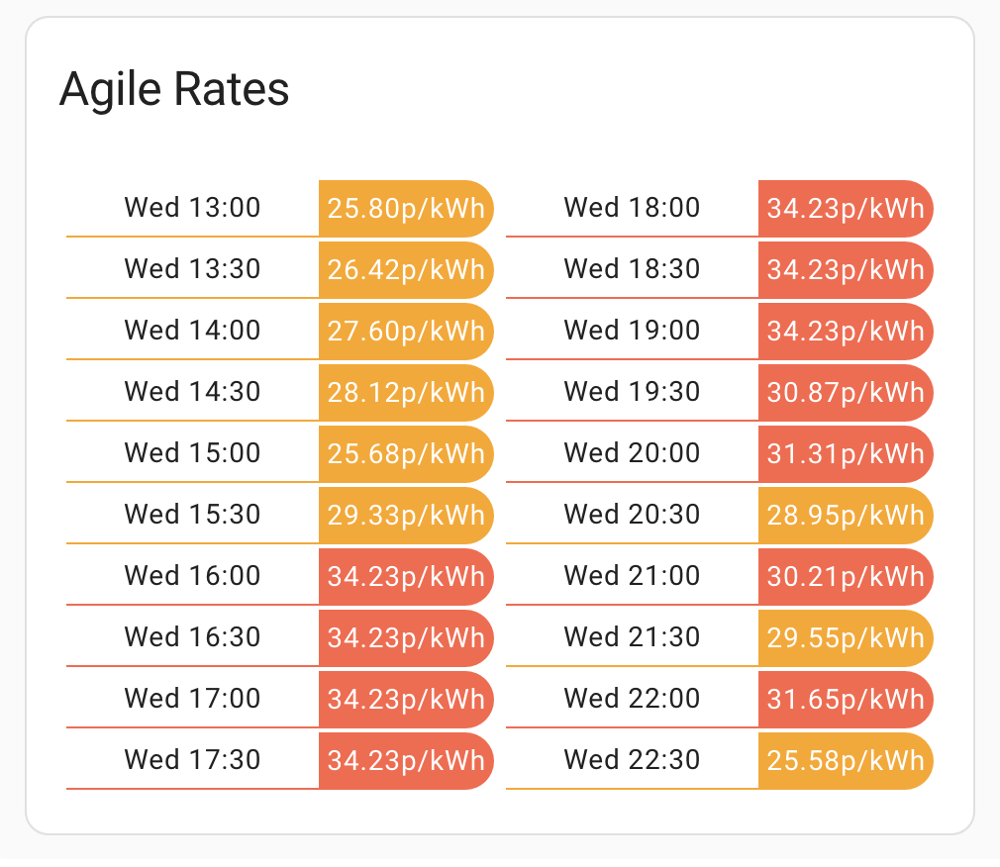

# Lovelace custom card for Octopus Energy Rate display

[](https://github.com/hacs/integration)

This lovelace card displays the Octopus Energy rate prices per each 30 minute slot, pulling the data from sensors of the the excellent [BottlecapDave/HomeAssistant-OctopusEnergy](https://github.com/BottlecapDave/) integration.

This provides a convenient, at a glance way to observe the prices on tariffs that change their price every 30 minutes, for example Octopus Agile.

#### Installation
##### HACS
The easiest way to install it is via [HACS (Home Assistant Community Store)](https://github.com/hacs/frontend). This will ensure you get updates automatically too. 

Simply click this button to go directly to the details page:

[](https://my.home-assistant.io/redirect/hacs_repository/?owner=lozzd&repository=octopus-energy-rates-card&category=plugin)

In the Home Assistant UI:
* Use HACS -> Frontend -> Top Right Menu -> Custom repositories
* Enter a repo of `lozzd/octopus-energy-rates-card` and category of "Lovelace", and click the Add button
* Click "Explore & Download Repositories" and start searching for "octo" and you should see the entry
* Click "Download" in the bottom right

This should automatically configure all the resources, so you can now skip to **Configuration**.

##### Manually
You can also install manually by downloading/copying the Javascript file in to `$homeassistant_config_dir/www/community/` and then add the Javascript file to Lovelace in the Home Assistant UI by using
Settings -> Dashboards -> Top Right Menu -> Resources

#### Configuration
Add the card to your dashboard using **Add Card -> Custom: Octopus Energy Rates Card**.

You'll need to then configure the yaml yourself - the `type` part is filled out for you. 

The only **required** key is the name of the entity sensor that contains the rates.

The easiest way to find that entity name is by opening the Search within Home Assistant: search for `current_rate` -> click the chosen result -> choose the Settings tab -> copy `Entity ID`.

(The format is `sensor.octopus_energy_electricity_{{METER_SERIAL_NUMBER}}_{{MPAN_NUMBER}}_current_rate`)

Here's an example yaml configuration:

```
entity: sensor.octopus_energy_electricity_<your_id_here>_current_rate
type: custom:octopus-energy-rates-card
cols: 2
showday: true
showpast: false
```

Here's a breakdown of all the available configuration items:

| Name        | Optional | Default       | Description                                                                                                                                          |
|-------------|----------|---------------|:-----------------------------------------------------------------------------------------------------------------------------------------------------|
| entity      | N        | N/A           | Name of the sensor that contains the rates you want to render, generated from the `HomeAssistant-OctopusEnergy` integration                          |
| cols        | Y        | 1             | How many columns to break the rates in to, pick the one that fits best with how wide your card is                                                    |
| showpast    | Y        | false         | Show the rates that have already happened today. Provides a simpler card when there are two days of dates to show                                    |
| showday     | Y        | false         | Shows the (short) day of the week next to the time for each rate. Helpful if it's not clear which day is which if you have a lot of rates to display |
| title       | Y        | "Agile Rates" | The title of the card in the dashboard                                                                                                               |
| mediumlimit | Y        | 20 (pence)    | If the price is above `mediumlimit`, the row is marked yellow                                                                                        |
| highlimit   | Y        | 30 (pence)    | If the price is above `highlimit`, the row is marked red.                                                                                            |
| roundUnits  | Y        | 2             | Controls how many decimal places to round the rates to                                                                                               |
| showunits   | Y        | N/A           | No longer supported. Never worked. Please set a blank string using `unitstr` (see below)                                                             |
| unitstr     | Y        | "p/kWh"       | The unit to show after the rate in the table. Set to an empty string for none.                                                                       |
| exportrates | Y        | false         | Reverses the colours for use when showing export rates instead of import                                                                             |
| hour12      | Y        | true          | Show the times in 12 hour format if `true`, and 24 hour format if `false`                                                                            |

#### A note on colouring

* The card is hardcoded to display plunge pricing (e.g, below 0p/kWh) as blue
* If the price is above `highlimit`, then the row is in red
* If the price is above `mediumlimit`, then the row is coloured orange/yellow
* Otherwise, the row is coloured is green.
* These are reversed if `exportrates` is set to `true`

#### Screenshot


#### Thanks/inspiration
This card was based on and reworked from the code [markgdev/home-assistant_OctopusAgile](https://github.com/markgdev/home-assistant_OctopusAgile/tree/master/custom_cards) which is no longer maintained. 
