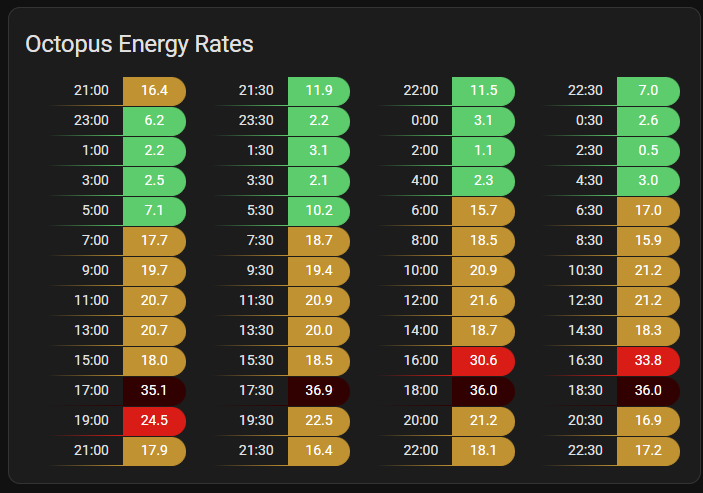

# Lovelace Custom Card for Octopus Energy Rate Display

This custom Lovelace card for Home Assistant displays Octopus Energy rate prices for each 30-minute slot. It pulls data from sensors provided by the [BottlecapDave/HomeAssistant-OctopusEnergy](https://github.com/BottlecapDave/) integration, offering a convenient, at-a-glance view of prices for tariffs that change every 30 minutes, such as Octopus Agile.



## Installation

### HACS

The easiest way to install it is via [HACS (Home Assistant Community Store)](https://github.com/hacs/frontend). This will ensure you get updates automatically too.

Simply click this button to go directly to the details page:

[](https://my.home-assistant.io/redirect/hacs_repository/?owner=gaco79&repository=octopus-energy-rates-card&category=plugin)

In the Home Assistant UI:

- Use HACS -> Frontend -> Top Right Menu -> Custom repositories
- Enter a repo of `gaco79/octopus-energy-rates-card` and category of "Lovelace", and click the Add button
- Click "Explore & Download Repositories" and start searching for "octo" and you should see the entry
- Click "Download" in the bottom right

This should automatically configure all the resources, so you can now skip to **Configuration**.

### Manual Installation

1. Download the `octopus-energy-rates-card.js` file.
2. Copy it to `$homeassistant_config_dir/www/community/`.
3. Add the JavaScript file to Lovelace resources:
   - Go to Settings -> Dashboards -> Resources
   - Add `/local/community/octopus-energy-rates-card.js` as a JavaScript module.

## Configuration

Add the card to your dashboard using **Add Card -> Custom: Octopus Energy Rates Card**.

### Basic Configuration

```yaml
type: custom:octopus-energy-rates-card
title: Octopus Energy Rates
entities:
  current: event.octopus_energy_electricity_<your_id_here>_current_day_rates
  past: event.octopus_energy_electricity_<your_id_here>_previous_day_rates
  future: event.octopus_energy_electricity_<your_id_here>_next_day_rates
```

### Full Configuration Options

```yaml
type: custom:octopus-energy-rates-card
title: Octopus Energy Rates
entities:
  current: event.octopus_energy_electricity_<your_id_here>_current_day_rates
  past: event.octopus_energy_electricity_<your_id_here>_previous_day_rates
  future: event.octopus_energy_electricity_<your_id_here>_next_day_rates
display:
  cols: 2
  hour12: false
  showday: true
  showpast: false
  unitstr: "p/KWh"
  roundUnits: 2
  multiplier: 100
limits:
  low: 0.15
  medium: 0.20
  high: 0.30
colours:
  negative: "#391CD9"
  low: "MediumSeaGreen"
  medium: "orange"
  high: "Tomato"
  highest: "red"
targetTimes:
  - entity: binary_sensor.example_target_time
    backgroundColor: "lightblue"
    prefix: "mdi:clock"
```

### Configuration Options

| Option        | Type   | Default                                 | Description                                    |
| ------------- | ------ | --------------------------------------- | ---------------------------------------------- |
| `title`       | string | "Octopus Energy Rates"                  | Card title                                     |
| `entities`    | object | [See here](#entities-configuration)     | Entity IDs for current, past, and future rates |
| `display`     | object | [See here](#display-configuration)      | Display settings                               |
| `limits`      | object | [See here](#limits-configuration)       | Rate thresholds                                |
| `colours`     | object | [See here](#colours-configuration)      | Colors for different rate levels               |
| `targetTimes` | array  | [See here](#target-times-configuration) | Target time configurations                     |

#### Entities Configuration

| Option    | Type   | Required | Description                 |
| --------- | ------ | -------- | --------------------------- |
| `current` | string | Yes      | Entity ID for current rates |
| `past`    | string | No       | Entity ID for past rates    |
| `future`  | string | No       | Entity ID for future rates  |

#### Display Configuration

| Option       | Type    | Default | Description              |
| ------------ | ------- | ------- | ------------------------ |
| `cols`       | number  | 1       | Number of columns        |
| `showpast`   | boolean | false   | Show past rates          |
| `showday`    | boolean | true    | Show day of the week     |
| `hour12`     | boolean | true    | Use 12-hour format       |
| `roundUnits` | number  | 2       | Decimal places for rates |
| `unitstr`    | string  | "p/kWh" | Unit string              |
| `multiplier` | number  | 100     | Rate multiplier          |

#### Limits Configuration

| Option   | Type   | Default | Description                |
| -------- | ------ | ------- | -------------------------- |
| `low`    | number | 0.15    | Threshold for low rates    |
| `medium` | number | 0.25    | Threshold for medium rates |
| `high`   | number | 0.35    | Threshold for high rates   |

#### Colours Configuration

| Option     | Type   | Default          | Description              |
| ---------- | ------ | ---------------- | ------------------------ |
| `negative` | string | "#391CD9"        | Color for negative rates |
| `low`      | string | "MediumSeaGreen" | Color for low rates      |
| `medium`   | string | "orange"         | Color for medium rates   |
| `high`     | string | "Tomato"         | Color for high rates     |
| `highest`  | string | "red"            | Color for highest rates  |

#### Target Times Configuration

| Option            | Type   | Description                      |
| ----------------- | ------ | -------------------------------- |
| `entity`          | string | Entity ID for target time        |
| `backgroundColor` | string | Background color for target time |
| `prefix`          | string | Icon prefix for target time      |

## Acknowledgements

This card is based on the work of [Lozzd's Octopus Energy Card](https://github.com/lozzd/octopus-energy-rates-card) and [markgdev's OctopusAgile card](https://github.com/markgdev/home-assistant_OctopusAgile/tree/master/custom_cards).
